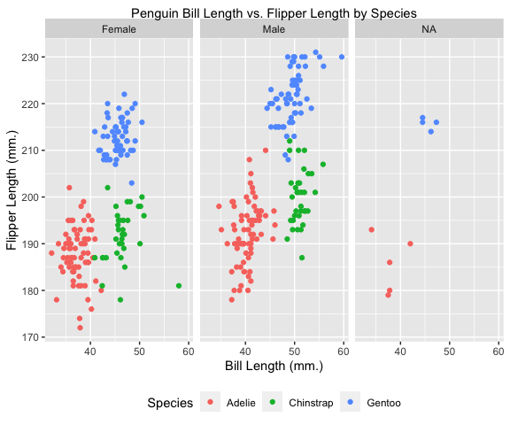

PUBH 7462 HW1
================
Anthony Johnson
1/29/2022

# Problem 2.1 Independent Bivariate Normal Random Sample (25pts)

``` r
library(tidyverse)
# Make tibble for random sample
norm_random_sample <- tibble(x = rnorm(1000, 0, 1), y = rnorm(1000, 1, 2), 
                             sum_indicator = ifelse(x + y > 0.5, TRUE, FALSE))

# Change the data and then plot it
norm_random_sample %>%
  mutate(sum_indicator = factor(sum_indicator, labels = c("No", "Yes"))) %>%
  mutate(sum_indicator = fct_relevel(sum_indicator,"Yes")) %>%
  ggplot(aes(x = x, y = y, color = sum_indicator)) +
  geom_point() +
  labs(title = "Independent Bivariate Normal Random Sample", color = "X + Y > 0.5") +
  xlab("Random Sample N(0, 1)") + 
  ylab("Random Sample N(1, 2)")
```


# Problem 2.2 Penguin EDA (25pts)

``` r
# Read data with a relative path
penguin.df <- read_rds("./data/penguin.RDS")
```

A case is a specific penguin. There are 344 observations and 8
variables. The `species` variable describes the species of penguin
(Adélie, Chinstrap and Gentoo). The `island` variable describes the
island the penguin lives on (Biscoe, Dream or Torgersen).
`bill_length_mm` describes the length of the penguin’s bill in
millimeters. `bill_depth_mm` describes the depth of the penguin’s bill
in millimeters. `flipper_length_mm` describes the length of the
penguin’s flipper in millimeters. `body_mass_g` describes the penguin’s
body mass in grams. `sex` describes the penguin’s sex (male or female).
`year` describes the year of the study (2007, 2008, or 2009).

The mean flipper length is 201 with a standard deviation of 14.

The mean bill length is 44 with a standard deviation of 5.

``` r
# First create a factor variable for sex
penguin.df$sex <- factor(penguin.df$sex, labels = c("Female", "Male"))

# Making a plot of bill length vs. flipper length that is colored by species and faceted by sex
penguin.df %>%
  ggplot(aes(x = bill_length_mm, y = flipper_length_mm, color = species)) +
  geom_point() +
  facet_wrap(~ sex, labeller = labeller("Female", "Male")) +
  labs(title = "Penguin Bill Length vs. Flipper Length by Species", color = "Species") +
  xlab("Bill Length (mm.)") +
  ylab("Flipper Length (mm.)")
```



Some of the penguin’s sexes were not known and they are in the NA panel.
Each species seems to be grouped together and the groups for each sex
look similar to each other. The Adelie penguins have the smallest bills,
but similar flipper length to the Chinstrap penguins. The Gentoo
penguins have the largest flippers, but have similar bill lengths to the
Chinstrap penguins.
